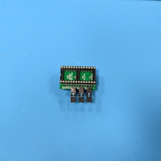
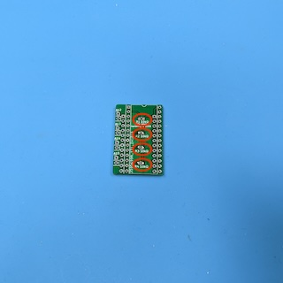
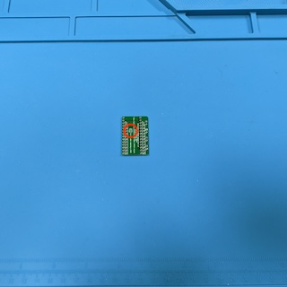
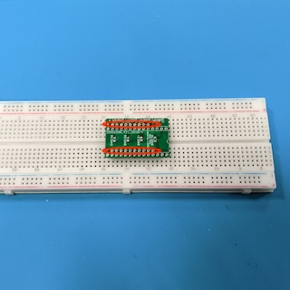
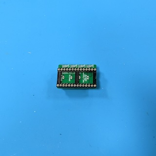
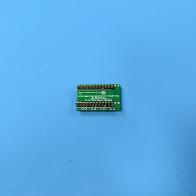
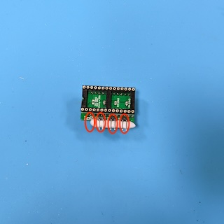
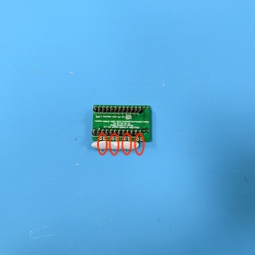

# 2332/2364 to EPROM Adapter

This repository contains the KiCad project and Gerber files for an adapter that
allows to replace 2332 and 2364 ROMs with 2764, 27128, 27256 or 27512 EPROMs.

> [!WARNING]
> This adapter is currently only used for replacing 2364 ROMs. Replacing 2332
> ROMs is untested! Use at your own risk!

## Ordering the PCB

The subdirectory "gerber-files" contains a Zip file you can use to order the PCB
from PCB manufacturers like PCBWay or JLCPCB. Simply upload the Zip on their web
page. I recommend to use the standard PCB thickness of 1.6mm and HASL finishing.

## Building the Adapter

### Bill of Materials

* __2x 1x12 Pin Straight Male Precision Header 2.54mm pitch__.

  Used to connect the adapter with the socket of the ROM. Make sure that you use
  precision headers (round/machined pins) and not standard square pin headers,
  because these will wear off the socket!

* __1x DIP28 Precision Socket 2.54mm pitch 15.24mm width__.

  Used to connect the EPROM to the adapter. I recommend to use a precision
  socket, because standard sockets with double spring contacts collide with the
  pin headers. When you use standard sockets, you have to cut the pin headers.

* __3x (when replacing a 2364) or 4x (when replacing a 2332) 10kOhm SMD Resistors 0805 size__.

  These are pull-up resistors for the address lines A13 (R2), A14 (R3) and A15
  (R4). When replacing a 2332, you need another pull-up resistor on address line
  A12 (R1).

* __3x (when replacing a 2364) or 4x (when replacing a 2332) 1x2 Pin Header 2.54mm pitch__.

  These are used to externally switch the address lines A13, A14, and A15. When
  replacing a 2332, you need another pin header for address line A12. You may
  use straight or angled pin headers, depending on the space available around
  the adapter. When using straight pins, you need space above the adapter, and
  when using angled, you need space to the side of the adapter.

* __3x (when replacing a 2364) or 4x (when replacing a 2332) Jumper 2.54mm pitch__.

  These are used to externally switch the address lines A13, A14, and A15. When
  replacing a 2332, you need another Jumper for address line A12. These jumpers
  can also replaced by switches or a microcontroller, this depends on how you
  want to switch the contents of the EPROM.

### Soldering the Pull-Up Resistors R1, R2, R3 and R4

You have to start with soldering the resistors on the top of the PCB, because
they are located under the socket. These are the only SMD parts and quite fiddly
to solder by hand. When replacing a __2332__ ROM, you have to populate all four
resistors R1, R2, R3 and R4. When replacing a __2364__ ROM, you only have to
populate the three resistors R2, R3 and R4, __R1 must not be populated__!

### Prepare the Jumper JP1

When replacing a __2332__ ROM, you have to cut the jumper JP1 on the bottom of
the PCB. Be careful and use a sharp cutter knife, and check with a multimeter
that there is no continuity! When replacing a __2364__ ROM, you have to leave
JP1 connected as it is.

### Soldering the Pin Headers

Now, solder the two 12 pins precision pin headers to the PCB. As I said above,
please use precision (round/machined) pin headers instead of the standard square
pin headers, even though they are quite expensive, otherwise you will wear off
the socket. The round pin headers will also wear off the socket, but much less
than the standard pin headers.

Be careful to use the correct location on the bottom side of the PCB - use the
two shorter rows of 12 holes marked with rectangles on the silk screen!

It is crucial that you solder these pins straight to the PCB, otherwise they
will not fit into the socket later. I used an old breadboard as a soldering aid,
but it sucks away a lot of heat, and you will need to apply a lot of heat when
soldering. Be careful not to drop any solder onto the breadboard!

### Soldering the Socket

Solder the socket to the top of the PCB. Mind the orientation, the notch of the
socket should face in the direction marked on the silk screen (to the right in
the image below). When you do __not__ use a precision socket (which I
recommend), you have to cut the pins soldered in the previous step with a side
cutter so that the socket sits flush on the PCB.

Soldering is quite fiddly, because you have to solder next to and in between the
pin headers. Be careful not to melt the plastic of the pin headers!

### Soldering the Pin Headers for the Address Lines

The last step is to solder the pin headers for the address lines. When replacing
a 2332 ROM, solder the pin headers for address lines A12, A13, A14 and A15. When
replacing a 2364 ROM, solder the pin headers only for address lines A13, A14 and
A15. Do not solder a pin header for A12!

Make sure to solder the pin headers as straight as possible. In the images
below, I use an adhesive like
[Blu Tack](https://en.wikipedia.org/wiki/Blu_Tack).

## Using the Adapter

Carefully push the adapter into the ROM socket. Mind the orientation - the notch
of the ROM socket and the notch of the EPROM socket on the adapter must point to
the same direction! Try not to repeatedly insert and remove the adapter - it
wears off the ROM socket!

## License

2332/2364 to EPROM Adapter (c) by Patrick Dähne

2332/2364 to EPROM Adapter is licensed under a
Creative Commons Attribution-NonCommercial-ShareAlike 4.0 International License.

You should have received a copy of the license along with this
work. If not, see <https://creativecommons.org/licenses/by-nc-sa/4.0/>.
